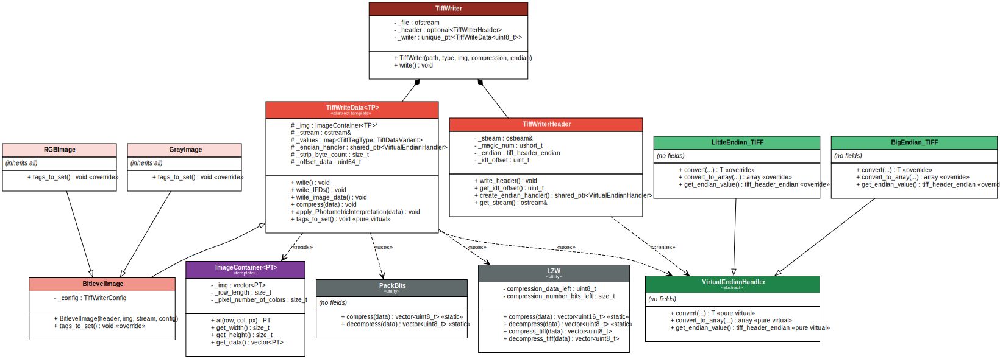

[Documentation](https://maximiliank-dev.github.io/Tiff-Image/index.html)

## TiffWriter Class Hierarchy

The diagram below shows the class structure of the TiffWriter, including its composition with `TiffWriterHeader` and `TiffWriteData`, the image-type subclasses (`BitlevelImage`, `GrayImage`, `RGBImage`), the endian handlers, and the compression utilities (`PackBits`, `LZW`).

